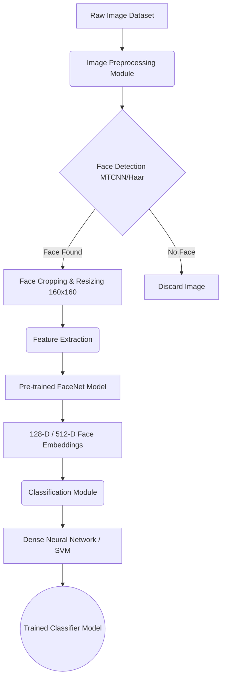
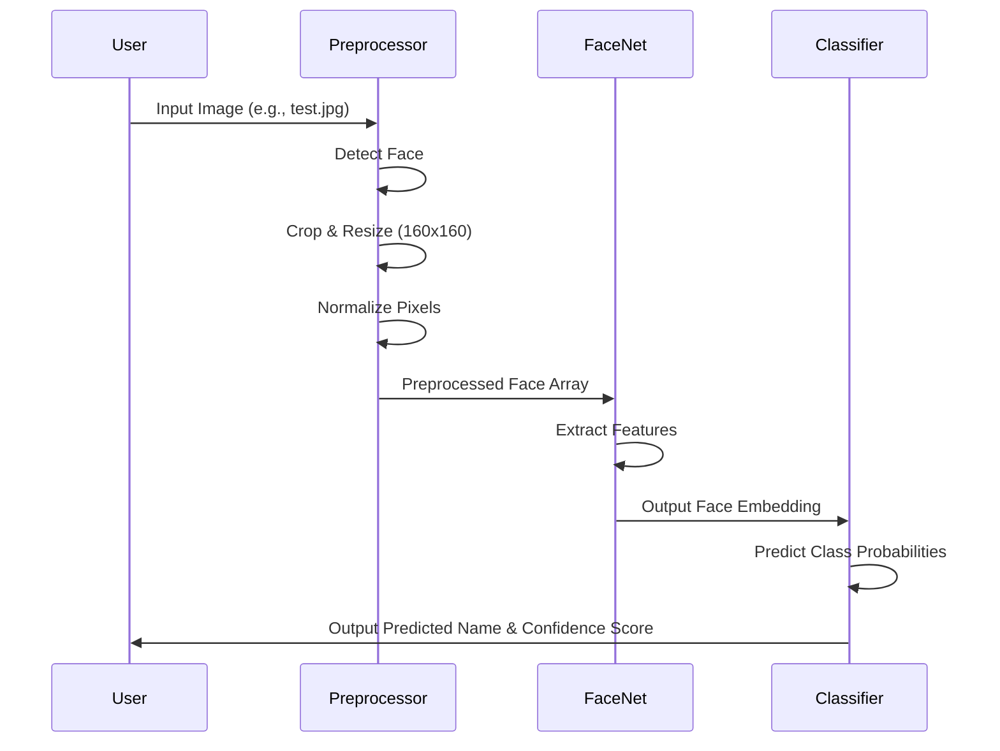

# System Architecture and Workflow

## 1. System Architecture Diagram

This diagram illustrates the high-level architecture of the Face Identification System.

## 2. Workflow Diagram (Inference / Prediction)

This diagram shows the step-by-step workflow when a new image is fed into the system for prediction.

